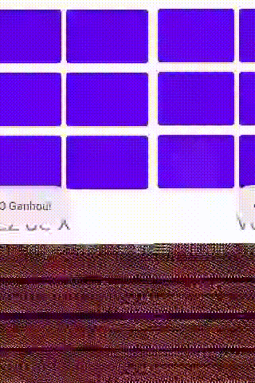

# Atividade: Jogo da Velha

1. Construa um Jogo da Velha simples;
1. Deve ser composto por apenas uma tela;
1. O jogo deve apresentar:
    - A pontuação atual;
    - O jogador atual;
    - Uma mensagem para indicando o jogador que ganhar;
    - Uma mensagem para indicar que houve um empate;
    - Uma mensagem para indicar uma jogada inválida;
    - Uma opção para reiniciar o jogo atual;

# Exemplo
